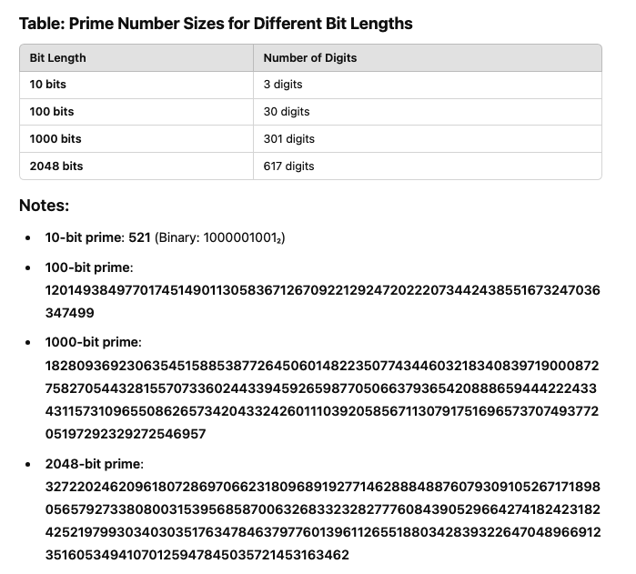
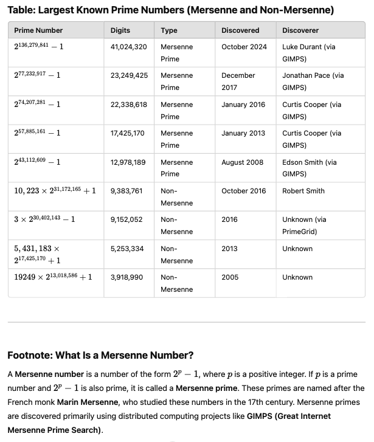

# How Prime Numbers Are Used in RSA

Prime numbers are used in RSA (Rivest–Shamir–Adleman) encryption, a cornerstone of the Public Key Infrastructure (PKI) system, because they enable the creation of a large modulus ($n = p \times q$) that is computationally infeasible to factor into its prime components. This underpins the security of PKI by ensuring that public and private key pairs remain secure for encrypting, decrypting, and authenticating sensitive data.

Here’s a step-by-step explanation of RSA encryption for $\( p = 3 \), \( q = 11 \)$, and the message $\( M = 5 \)$:

### Step 1: Choose Two Prime Numbers

We choose two primes:  

$p = 3 \quad \text{and} \quad q = 11$

### Step 2: Calculate $n$ (the modulus)  

$n = p \times q = 3 \times 11 = 33$

This $n$ will be part of both the public and private keys.

### Step 3: Calculate $\phi(n)$ (Euler’s Totient Function)  

Once $p$ and $q$ are chosen, the next step is to compute the totient function $\phi(n) = (p-1)(q-1)$. This function plays a key role in the generation of the private key. While $p$ and $q$ are used to derive $n$, it is $\phi(n)$ that determines the private key $d$ by finding the modular inverse of the public key exponent $e$. This step ensures that the private key is mathematically linked to the public key

$\phi(n) = (p - 1) \times (q - 1)$

$\phi(n) = (3 - 1) \times (11 - 1) = 2 \times 10 = 20$

### Step 4: Choose the Public Exponent $e$ which must be relatively prime to $\phi(n)$  

Choose an $e$ such that:
1. $1 < e < \phi(n)$  
2. $\text{gcd}(e, \phi(n)) = 1$ (relatively prime to $\phi(n)$, meaning $e$ and $\phi(n)$ have no common factors other than $1$).

We need to find a value for $e$ that satisfies:
1. $1 < e < 20$  
2. $\text{gcd}(e, 20) = 1$

Start testing small integers for $e$:
- $e =  2$:
  
   $gcd(2,20)=2$ (not relatively prime, so not valid).
  
- $e =  3$:
  
   $gcd(3,20)=1$ (relatively prime, so valid).

Let’s select $e = 3$, which satisfies these conditions.  

The **public key** would be represented as a pair:

$$(e,n) = (3,33)$$  

(Note) Two numbers are relatively prime (also called coprime) if they share no common factors other than 1. 
This means their greatest common divisor (GCD) is 1.  

### Step 5: Calculate the Private Key $d$  
The private key $d$ is the modular multiplicative inverse of $e$ modulo $\phi(n)$, meaning:  
 
$$e \times d \equiv 1 \ (\text{mod} \ \phi(n))$$
 

To find $d$, solve:

$$3 \times d \equiv 1 \ (\text{mod} \ 20)$$
 

Using the Extended Euclidean Algorithm:
 
$$d = 7$$
 
Now we have:  
- **Public Key**: $(e, n) = (3, 33)$
- **Private Key**: $(d, n) = (7, 33)$

### Step 6: Encrypt the Message $M = 5$ using public key, $(e, n) = (3, 33)$  
The encryption formula is:
 
$$C = M^e \ (\text{mod} \ n)$$
 
Substitute $M = 5$, $e = 3$, and $n = 33$:

$$C = 5^3 \ (\text{mod} \ 33)$$

1. Calculate $5^3$:

   $$5^3 = 5 \times 5 \times 5 = 125$$

2. Reduce modulo $33$:  
   
   $$C = 125 \ (\text{mod} \ 33) = 125 - 3 \times 33 = 125 - 99 = 26$$
   

So, the encrypted message is:
 
   $$C = 26$$   

### Step 7: Decrypt the Ciphertext $C = 26$ using private key, $(d, n) = (7, 33)$  
The decryption formula is:

$$M = C^d \ (\text{mod} \ n)$$

Substitute $C = 26$, $d = 7$, and $n = 33$:
 
$$M = 26^7 \ (\text{mod} \ 33)$$

Instead of directly calculating $26^7$, use modular exponentiation for efficiency:
1. $26^2 \ (\text{mod} \ 33) = 26 \times 26 = 676 \ (\text{mod} \ 33) = 16$
2. $26^4 \ (\text{mod} \ 33) = 16 \times 16 = 256 \ (\text{mod} \ 33) = 25$
3. $26^7 \ (\text{mod} \ 33) = 26^4 \times 26^2 \times 26 \ (\text{mod} \ 33) = 25 \times 16 \times 26 \ (\text{mod} \ 33)$
   - $25 \times 16 = 400 \ (\text{mod} \ 33) = 4$
   - $4 \times 26 = 104 \ (\text{mod} \ 33) = 5$

Thus, the decrypted message is:

$$M = 5$$

### Final Result
- **Original Message**: $M = 5$  
- **Encrypted Message**: $C = 26$  
- **Decrypted Message**: $M = 5$

This demonstrates how RSA ensures secure encryption and decryption using prime numbers. 

---

## How This Works in PKI  

### **Key Distribution:**
You publish your **public key** $(e,n) = (3, 33)$ so that anyone can send you encrypted messages. When sending a public key in RSA, you typically send the two numbers 
$e$ (the public exponent) and $n$ (the modulus), so the public key would be represented as a pair $(e,n)$:

$$(e,n) = (3,33)$$

Your **private key** $(d, n) = (7, 33)$ is kept secret.  
**(Note 1)**  
However, the numbers $e=3$ and $n=33$ are very small and not secure for real-world RSA encryption. These numbers are simply for illustration, and actual RSA keys used for secure communication have much larger values (typically hundreds of bits long for both $e$ and $n$).
In practice, $n$ is usually the product of two large prime numbers $p$ and $q$, and $e$ is a smaller number, often $65537$, but it can be any number that is coprime with $(p - 1)(q - 1)$.  
**(Note 2: More realistic example)**  
$e=65537$ (common choice for the public exponent)  
$n=3233$ (product of two prime numbers, 61 and 53, for example)  
So, the **public key** would be something like:

$$(e,n) = (65537,3233)$$

### **Secure Communication:**
A sender **encrypts** $M=5$ using your **public key**, producing ciphertext 
$C=26$.  
Only **you** can **decrypt** it using your **private key**, recovering $M=5$.    
  
### **Digital Signatures (Authentication):**
You can **sign** messages using your **private key**, and anyone can **verify** the signature with your **public key**.  

---
# The Role of Prime Numbers in RSA  
Prime numbers, by definition, have no divisors other than $1$ and themselves. This unique property makes them essential in the construction of RSA. Here’s how they fit into the RSA algorithm:

## Key Generation  
The first step in RSA is to choose two large prime numbers, denoted $p$ and $q$.  
These numbers must be kept secret and should be randomly chosen to ensure their unpredictability. The product of these primes, 
$n = p \times q$, forms the modulus used in both the public and private keys. The modulus $n$ is a part of both the public key 
$(e,n)$ and the private key $(d,n)$.  

- The size of $p$ and $q$ is crucial for the security of RSA. If these primes are too small, $n$ can be easily factored, undermining the encryption.  Large primes ensure that factoring $n$ becomes computationally infeasible, even with advanced algorithms.  

## Euler’s Totient Function  
Once $p$ and $q$ are chosen, the next step is to compute the totient function $\phi(n) = (p-1)(q-1)$. This function plays a key role in the generation of the private key. While $p$ and $q$ are used to derive $n$, it is $\phi(n)$ that determines the private key $d$ by finding the modular inverse of the public key exponent $e$.

- If $p$ and $q$ are chosen correctly, this step ensures that the private key is mathematically linked to the public key, but finding the private key from the public key without knowing $p$ and $q$ is infeasible due to the difficulty of factoring $n$.  

## Security through Factoring  
The primary security mechanism in RSA relies on the difficulty of factoring large composite numbers. The larger $n$ is, the harder it becomes to factor into its prime components $p$ and $q$. This is because the number of possible factorizations increases exponentially with the size of $n$.  
- The computational effort required to factor large numbers grows substantially as the primes $p$ and $q$ grow in size. For instance, a 2048-bit key has a modulus $n$ that is made up of two primes each approximately 1024 bits long. Factoring such a number using traditional methods would take an enormous amount of time, making it practically impossible to break the encryption within a reasonable time frame.

---
# Why Are Large Primes Important?
The security of RSA is directly tied to the choice of large primes. Here’s why:

## 1. Unpredictability
By selecting large, random primes for $p$ and $q$, RSA ensures that the encryption is not easily predictable or reproducible by attackers. The primes must be generated randomly to avoid patterns that could be exploited.  

## 2. Computational Difficulty 
Factoring large numbers is not only time-consuming but also computationally challenging. While there are efficient algorithms for factoring small numbers, these methods become exponentially less effective as the size of the number grows. For example, the best-known factoring algorithms, such as the General Number Field Sieve (GNFS), become exponentially more difficult to apply as the size of the numbers increases.

## 3. Security Margin  
By using very large primes (often 2048 bits or more), RSA provides a security margin against advances in computing power. As computational capabilities improve, the size of the primes used in RSA can also be increased, ensuring that the system remains secure.  

---
# The Challenge of Prime Number Generation  
One of the challenges in RSA is the generation of large prime numbers. Although there are efficient probabilistic primality tests (such as the Miller-Rabin test), generating large primes that meet the security requirements can still be computationally intensive. The primes must be large enough to make factoring the modulus $n$ infeasible, but not so large that generating them becomes impractical.  

In practice, the generation of prime numbers for RSA often involves using specialized algorithms that generate random numbers and test their primality. If a number passes the primality test, it can be used in RSA key generation. However, care must be taken to ensure that the primes are not too close to each other, as this could make the factorization of $n$ easier.  

---
# Prime Numbers and RSA Security  
The security of RSA depends entirely on the difficulty of factoring the modulus $n$. This difficulty arises because, once $p$ and $q$ are selected, there are no shortcuts to factoring their product. The relationship between the modulus $n$ and the totient $\phi(n)$ is hidden behind the secrecy of the prime numbers used to generate them.  

---
# Prime Numbers in RSA (2048 bits) are Huge!  
  

---
# Largest Known Prime Number (Mersenne Prime)  
  
  
As of January 2025, the largest known prime is a Mersenne prime, discovered on October 12, 2024, through the Great Internet Mersenne Prime Search (GIMPS). This prime, $2^{136,279,841} – 1$, has an astonishing $41,024,320$ digits.
